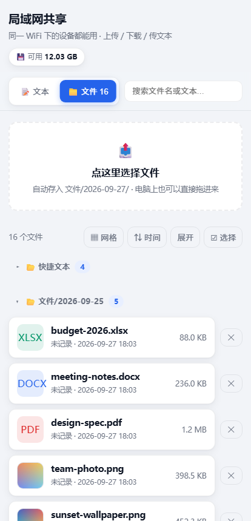
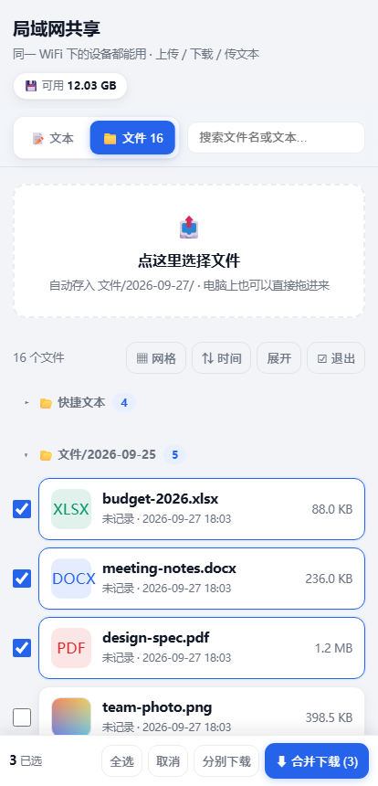
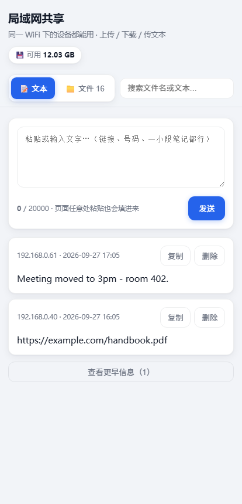
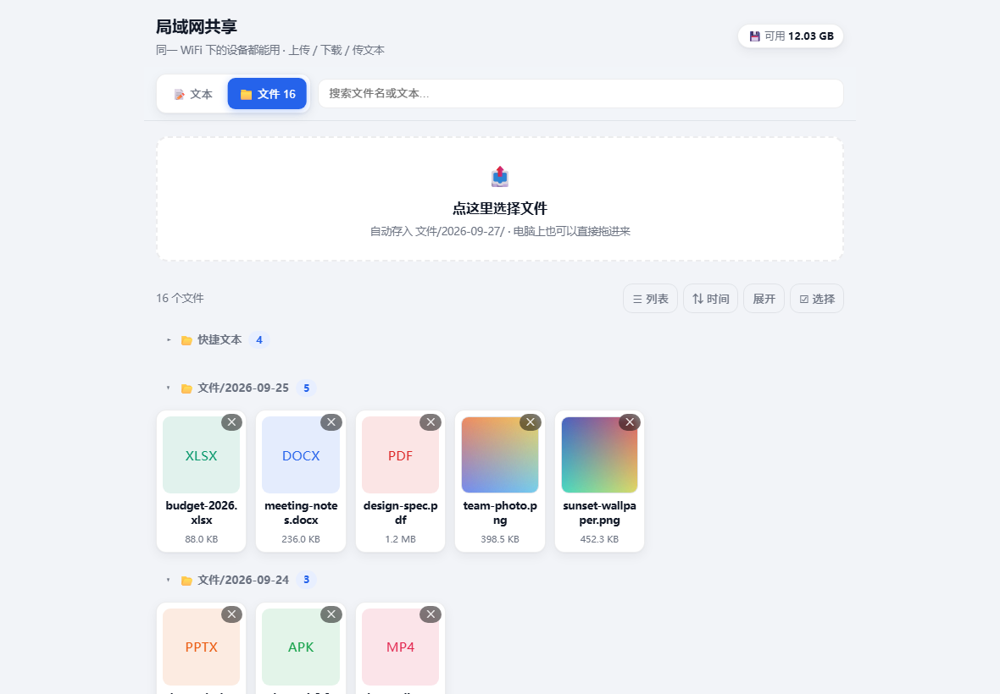

# lan-share

> Share files and text between the devices on your LAN — one Node.js file, no dependencies.

[中文说明 →](README.zh-CN.md)

<p align="center">
  
  
  
  
</p>

## ⚠️ No authentication

Only for *trusted LANs*: anyone who can reach the port can browse, download and upload everything.
Never expose it to the internet without a reverse proxy (or VPN) in front.

## Windows: no Node.js needed

[Download `best_lan-share-0.1.0-beta-win-x64.exe`](https://github.com/yourui233/best_lan-share/releases) (89 MB)
· [faster download](https://v4.gh-proxy.org/https://github.com/yourui233/best_lan-share/releases/download/v0.1.0-beta/best_lan-share-0.1.0-beta-win-x64.exe)
if GitHub is slow. Double-click it: the first run opens a setup wizard in your browser — shared
folder, port, options — on `127.0.0.1` only. After that a double-click just serves.

`SHA256 ad9f29853ed659eea18386307cdc4052b3f104a41a50d8e387a7097387d2a41a` — check it with
`certutil -hashfile best_lan-share-0.1.0-beta-win-x64.exe SHA256`.

<p align="center">
  
  
</p>

| Command | What it does |
|---|---|
| `lan-share.exe` | start — wizard on the first run, then it just serves |
| `lan-share.exe --setup` | run the wizard again |
| `lan-share.exe --uninstall` | remove autostart, shortcut and config |
| `lan-share.exe <dir> [port] [data-dir]` | skip the wizard, like the Node version |

Not code-signed, so SmartScreen asks once (*More info → Run anyway*) and the firewall asks for
**private** networks. No installer, no admin rights, at most one registry value.

## Quick start

```bash
git clone https://github.com/yourui233/best_lan-share.git && cd best_lan-share
node share-server.js ./shared 8080        # Node >= 18.15; no npm install
```

Then open `http://<this-machine-ip>:8080/` from any device on the same network.

## What it does

- **Files** — drag & drop or multi-select upload into `文件/<YYYY-MM-DD>/`; download, image
  thumbnails and lightbox, search, list/grid view, sort by time/size/name.
- **Multi-select download** — merge the selection into one streamed `.zip` (exact
  `Content-Length`, so the progress bar is honest) or download each file separately.
- **Text notes** — paste text or a link and every device sees it; also written to `快捷文本/*.txt`.
- **Delete protection** — only the device that uploaded a file (or the host) can delete it.
- **LAN protection** — Host/Origin checks against DNS rebinding, path traversal and Windows reserved
  names, upload cap, free-space guard, `nosniff`, forced attachment downloads, SVG never inlined.

Other technical details: **[docs/technical.md](docs/technical.md)**.

## License

MIT
