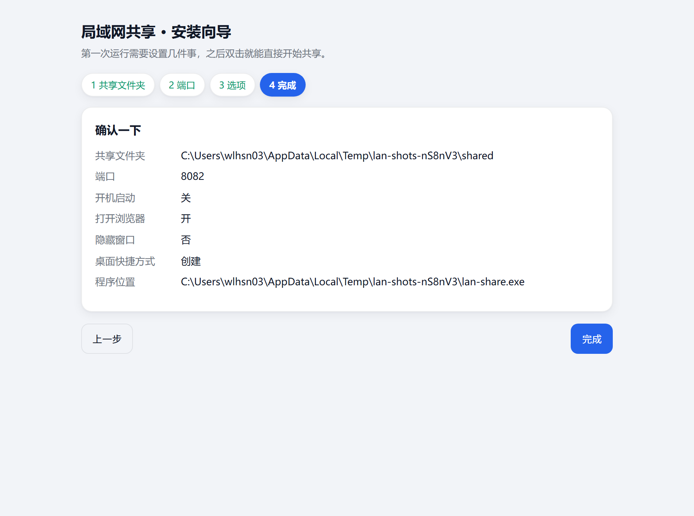

# best_lan-share 局域网共享

> 同一网络下的设备之间互传文件、互传文字 —— 一个 Node.js 文件，零依赖。

中文 | [English](README.en.md)

<p align="center">
  
  
  
  
</p>

跑服务的那台机器装好，**其它设备什么都不用装** —— 手机、平板、别人的电脑，用浏览器打开一个网址，
就能往里放文件、也能把文件拿走。不用注册账号，不用装 App，不用数据线，也不经过任何服务器。

## ⚠️ 没有鉴权

**只适合可信的局域网。** 没有账号、没有密码、没有令牌：能访问到这个端口的人，就能浏览、下载、上传、
删除。不要直接暴露到公网 —— 确有外网需求，请在前面加一层带认证的反向代理或 VPN，**并且必须设
`SHARE_HOSTS`**（见[安全模型](#安全模型)），否则 Host 校验会把经代理进来的请求全部拒掉。

## 快速开始

### Windows：下载单文件 exe，不用装 Node

到 **[Releases](https://github.com/yourui233/best_lan-share/releases)** 页面下载最新的
`best_lan-share-<版本>-win-x64.exe`，双击即可。首次运行会在浏览器里打开安装向导（选共享文件夹、
端口、开机启动等），此时只监听 `127.0.0.1`；之后再双击就直接开始共享。

下载地址、文件体积、SHA256 和加速镜像都写在该版本的 Release 页面上，以那里为准。

<p align="center">
  
  
  
  
</p>

发布页上的文件名带版本号，下面为了简洁统一写成 `best_lan-share.exe` —— 改个名，或者直接用完整
文件名，都可以。

| 命令 | 作用 |
|---|---|
| `best_lan-share.exe` | 启动 —— 第一次走向导，之后直接服务 |
| `best_lan-share.exe --setup` | 重新配置 |
| `best_lan-share.exe --read-only` | 只读启动：别人只能看和下载，不能上传、发文字、删除 |
| `best_lan-share.exe --no-open` | 启动时不自动打开浏览器 |
| `best_lan-share.exe --uninstall` | 清掉开机启动、桌面快捷方式和配置文件（共享的文件一个都不动） |
| `best_lan-share.exe <目录> [端口] [数据目录]` | 跳过向导，与 Node 版完全一致 |

exe 没有代码签名，首次运行 SmartScreen 会拦一下（点「更多信息 → 仍要运行」），防火墙询问时勾选
**专用网络**。没有安装程序，不需要管理员权限：最多写一个当前用户的启动项、一个桌面快捷方式，以及
`%APPDATA%\lan-share` 下一个小 `.vbs`（仅在你勾了「无窗口启动」时）。

### 从源码跑

```bash
git clone https://github.com/yourui233/best_lan-share.git && cd best_lan-share
node share-server.js ./shared 8080        # 需要 Node >= 18.15，不用 npm install
```

然后用同一网络下的手机或电脑打开 `http://<这台机器的IP>:8080/`。控制台会把本机回环地址和能找到的
所有局域网地址都打印出来。

安装向导是打包 exe 专有的（它只监听回环地址，还会调用 Windows 原生对话框），从源码跑只有纯命令行，
`--setup` 在那边不起作用。

## 功能

- **文件** —— 拖拽或点选上传（支持多选），存进 `文件/<年-月-日>/`；把整个文件夹拖进来（或点
  「或选整个文件夹」）会连子目录一起保留，最深 8 层。每个文件独立显示进度和速度，重名自动改成
  `名称 (2).扩展名`，单文件上限 4 GiB，有剩余空间保护，文件名按 Windows 规则清洗（保留名、非法
  字符、结尾的点）。
- **断了也能续的下载** —— 勾选的文件、或者整个文件夹，都能「合并下载」打成一个边算边发的流式 zip
  （不落临时文件），也可以逐个下载。下载支持 HTTP `Range`：传到一半断了可以接着传，视频和音频还能
  直接在页面上播放，图片有缩略图和灯箱。
- **列表自己会动** —— 别的设备上传或删除后，列表会自动更新（轮询一个很小的版本号；你在搜索框里打字
  时不会有任何重排）。当前页签、视图、排序、展开的分组都按浏览器记住。
- **扫码进入** —— 页面上给出二维码和本机所有局域网地址，还带网卡名，手机不用手输 IP；虚拟网卡会标成
  「多半连不通」。
- **只读模式** —— 向导里一个勾、`--read-only`，或 `SHARE_READONLY=1`：所有人只能浏览和下载，不能
  上传、发文字、删除。
- **文本便签** —— 粘贴一段文字或链接，所有设备都能看到，同时落一份 `快捷文本/*.txt`。单条最多
  20000 字，超过 24 小时的默认收起，点一下就能翻出来。
- **找东西** —— 一处搜索同时匹配文件名和便签文字；列表 / 网格两种视图；按时间、大小、名称排序。
- **删除保护** —— 上传记录按浏览器记住，只有上传它的那个浏览器（或服务器本机）能删这个**文件**。
- **深色模式** —— 自动跟随系统的 `prefers-color-scheme`。

<p align="center">
  
  
</p>

## 文件都存在哪

```
<共享目录>/
├── 文件/
│   └── 2026-10-03/
│       ├── 报告.pdf
│       └── 照片/                        ← 你拖进来的子目录会照原样重建
└── 快捷文本/
    └── 2026-10-03_195644.txt            ← 一条便签一个文件

<共享目录>-data/                         ← 故意放在共享目录「之外」
├── files.json                         谁传的什么
└── notes.jsonl                        文本页签背后的索引
```

- 共享目录里的东西对所有人都可见 —— 包括你不用页面、直接拷进去的文件。
- `-data` 就在共享目录**旁边**，别人浏览共享目录时永远看不到它。
- 删掉 `-data` 会丢两样东西：便签历史（`.txt` 文件本身还在）和上传者记录；之后只有服务器本机能删文件。

## 环境变量

| 环境变量 | 默认值 | 作用 |
|---|---|---|
| `PORT` | `8080` | 没给端口参数、配置里也没有时监听的端口 |
| `SHARE_READONLY` | — | `1`/`true`/`yes`/`on` = 只读，优先级高于配置文件 |
| `SHARE_MAX_UPLOAD` | `4294967296` | 单文件上传上限（字节，默认 4 GiB） |
| `SHARE_HOSTS` | — | 追加允许的 `Host` 主机名，逗号分隔 —— **放在反向代理后面时必填** |
| `SHARE_CONFIG` | exe 旁边 | 指定的 JSON 配置文件路径 |
| `SHARE_NO_BROWSER` | — | `1` = 从不打开浏览器 |

配置写在 exe 旁边的 `lan-share.json`（名字是历史遗留，和程序名不一致，属正常）；那个位置写不进去时
退回 `%APPDATA%\lan-share\lan-share.json`。就是个普通 JSON（`root`、`port`、`data`、`open`、
`readOnly`、`autostart`、`hidden`、`shortcut`），手改也生效 —— 向导只是替你写这个文件。

## 安全模型

**它挡得住什么**

- **DNS rebinding 与跨站请求** —— 每个请求的 `Host` 必须是本机的名字或地址之一，`Origin` 也要对得上；
  来源不透明的请求直接拒绝。
- **路径穿越** —— 所有路径都由清洗过的片段重新拼出，并且必须落在共享目录之内。Windows 保留名
  （`con`、`lpt1` 等）、结尾的点与空格、控制字符都会被改写。
- **上传带来的 XSS** —— 文件名一律 HTML 转义，便签正文按纯文本渲染，SVG 永不内联，内联媒体带
  `Content-Security-Policy: default-src 'none'; sandbox`，所有响应带
  `X-Content-Type-Options: nosniff`，文件下载一律 `attachment`。
- **磁盘被塞满** —— 单文件上限，加上上传前与上传途中的剩余空间下限。
- **二维码接口** —— 只编码本服务器自己的局域网地址，不会变成一个谁都能用的免费二维码生成器。

**它挡不住什么**

- **不验证任何人的身份。** 同一网络里谁都能上传。如果你需要「人」之间的边界，这个工具不合适。
- **不加密任何东西。** 走的是明文 HTTP：文件内容和便签正文，任何能嗅探局域网的人都能看到。机密的东西
  不要放。
- **不隔离客户端之间的可见性。** 一台设备删不掉另一台传的文件，但能读到，而且每一条都显示上传者的 IP。
- **不保证链接安全。** 共享目录里已经存在的符号链接和目录联接会被跟随，指向外面的链接等于把那个目标
  也一起暴露。不要把这种链接放进你要共享的文件夹。

## 常见问题

**端口被占了** —— exe 会自己往后找下一个端口，最多试 10 次，并把真正用上的端口打印出来。从源码跑的
话，自己换一个端口传进去。

**手机打不开** —— 先确认两台设备在同一个网络（访客网络和「隔离」型 Wi-Fi 会挡住设备之间的互访），再让
防火墙放行这个程序并勾**专用网络**。点开页面上的 🔗 面板，选一个没有标成「虚拟网卡」的地址。

**我手动拷进去的文件，别的设备看不到** —— 自动刷新只跟踪通过页面产生的改动，从资源管理器拷进去的文件
需要手动刷新一下。

**删不掉某个文件** —— 只有上传它的那个浏览器，或者服务器本机能删。身份存在 cookie 里，所以换个浏览器、
或者清过 cookie，就会被当成另一台设备。

## 相关

- 架构、磁盘数据格式，以及零依赖实现的 zip 与二维码：**[docs/technical.zh-CN.md](docs/technical.zh-CN.md)**
- Windows 单文件版下载：[Releases](https://github.com/yourui233/best_lan-share/releases)
- 英文说明：[README.en.md](README.en.md)

## 许可证

MIT
